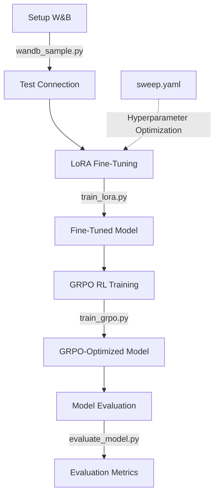

# Stoney-RL: Mechanistic Interpretability for Low-Resource Language Reasoning

## Overview
Stoney-RL is a research pipeline for exploring mechanistic interpretability in language models, with a focus on low-resource First Nations languages. The project leverages LoRA (Low-Rank Adaptation) fine-tuning, reward modeling, and GRPO (Group Regularized Policy Optimization) reinforcement learning to study how models reason through linguistic data, and how this reasoning differs from mathematical or high-resource language tasks.

## Key Features
- **LoRA Fine-Tuning:** Efficient parameter-efficient fine-tuning of large language models on reasoning-centric tasks.
- **Custom Reward Modeling:** Plug-and-play reward model stub for future multi-signal or human feedback integration.
- **GRPO RL Training:** Use of Hugging Face TRL's GRPOTrainer for reinforcement learning with custom rewards.
- **Mechanistic Interpretability:** Designed to probe and visualize attention mechanisms and reasoning steps in low-resource language contexts.
- **Weights & Biases Integration:** All experiments are tracked and logged for reproducibility and analysis.
- **Open, Synthetic Dataset:** Uses a synthetic Stoney Nakoda dataset, curated for linguistic reasoning and interpretability research.

## Project Structure
- `Instructions.txt`: Step-by-step playbook for reproducing the pipeline.
- `inspect_hf_dataset.py`: Script to inspect and validate the Hugging Face dataset.
- `wandb_sample.py`: Example script for logging metrics to Weights & Biases.
- `synthetic_stoney_data.jsonl`: The main dataset, uploaded to the Hugging Face Hub.

## Dataset
- **Source:** [HarleyCooper/synthetic-stoney-data](https://huggingface.co/datasets/HarleyCooper/synthetic-stoney-data)
- **Format:** Each entry contains a `question`, `answer`, and metadata fields. Designed for prompt/response training and evaluation.
- **Purpose:** Enables research on reasoning, attention, and interpretability in a low-resource, indigenous language context.

## Pipeline Steps
1. **Environment Setup**
   - Install dependencies (see `Instructions.txt`)
   - Configure Weights & Biases
2. **Dataset Inspection & Preparation**
   - Use `inspect_hf_dataset.py` to validate and explore the dataset
3. **Model Selection**
   - Choose a base model (e.g., DeepSeek-R1-Zero-7B, Phi-3-Mini-3.8B)
4. **LoRA Fine-Tuning**
   - Run supervised fine-tuning with LoRA adapters
   - Log all runs to W&B
5. **Reward Modeling (Optional)**
   - Implement or fine-tune a reward model for RL
6. **GRPO RL Training**
   - Reinforcement learning with custom reward function
7. **Evaluation**
   - Automatic evaluation with chrF, COMET, MAUVE, and W&B logging
8. **Hyperparameter Sweeps**
   - Use W&B sweeps for systematic search

## How to Run
1. **Clone the repo:**
   ```sh
   git clone https://github.com/HarleyCoops/Stoney-RL.git
   cd Stoney-RL
   ```
2. **Install dependencies:**
   See `Instructions.txt` for conda and pip setup.
3. **Inspect the dataset:**
   ```sh
   python inspect_hf_dataset.py
   ```
4. **Run LoRA fine-tuning:**
   Follow the code and instructions in `Instructions.txt`.
5. **Track experiments:**
   All runs are logged to Weights & Biases under the `stoney-rl` project.

## Running Locally with Docker

This method provides an isolated and reproducible environment for running the LoRA fine-tuning pipeline on a local machine with a suitable NVIDIA GPU.

### Prerequisites

-   **Docker Desktop**: Ensure Docker Desktop is installed and running on your system.
-   **NVIDIA GPU & Drivers**: A CUDA-enabled NVIDIA GPU (e.g., RTX 3090, 4080, 4090 with sufficient VRAM, ~16GB recommended for Phi-3-mini) and compatible NVIDIA drivers (CUDA 11.8+ recommended) must be installed on the host machine.
-   **W&B Credentials**: Create a `.env` file in the root of the `Stoney-RL` project directory containing your Weights & Biases credentials:
    ```env
    WANDB_API_KEY="your_api_key_here"
    WANDB_ENTITY="your_username_or_team_here"
    WANDB_PROJECT="stoney-rl"
    ```

### Steps

1.  **Build the Docker Image**:
    Navigate to the `Stoney-RL` directory in your terminal. The provided `Dockerfile` uses the `pytorch/pytorch:2.2.1-cuda11.8-cudnn8-runtime` base image and installs the necessary Python dependencies, including pinned versions identified during troubleshooting.
    ```bash
    docker build -t stoney-rl-local .
    ```
    This command builds the image and tags it as `stoney-rl-local`.

2.  **Run the Training Container**:
    Execute the following command to start the container, run the training script, and mount the local directory:
    ```bash
    docker run --rm --gpus all -v .:/app stoney-rl-local
    ```
    *   `--rm`: Removes the container after it finishes.
    *   `--gpus all`: Makes your host GPU(s) available inside the container.
    *   `-v .:/app`: Mounts the current directory (`Stoney-RL`) to `/app` inside the container. This allows the container to access `train_lora_local.py`, `.env`, and save outputs (like checkpoints in `stoney_lora_phi3_local_ckpt/`) back to your local filesystem.

3.  **Monitor Training**:
    The container will execute the `train_lora_local.py` script. This script is pre-configured to:
    *   Use the `microsoft/Phi-3-mini-4k-instruct` model.
    *   Load the `HarleyCooper/StoneyNakoda45k` dataset.
    *   Load W&B credentials from the `.env` file.
    *   Perform LoRA fine-tuning.
    *   Log metrics and progress to your specified Weights & Biases project (`stoney-rl`).
    *   Save the final LoRA adapter and tokenizer to the `stoney_lora_phi3_local_merged/` directory locally (due to the volume mount).

## Distributed Training with Hyperbolic Labs

This project is configured for distributed training on Hyperbolic Labs cloud infrastructure. This approach offers:

- **Scalable GPU Access:** Access to high-memory NVIDIA GPUs (A100, H100) for faster training
- **Managed Environment:** Pre-configured CUDA environments with optimal drivers
- **Cost Effectiveness:** Pay-as-you-go compute versus fixed hardware costs
- **Parallelization:** Ability to run multiple experiments simultaneously

### Environment Requirements

When configuring your Hyperbolic Labs instance, ensure it meets these specifications:

- **Linux with CUDA 11.8+** (driver ≥ 525)
- **GPU Memory:**
  - 24+ GB VRAM for DeepSeek-R1-Zero-7B (A10, A100, H100)
  - 12+ GB VRAM for Phi-3-Mini-3.8B quantized models (T4, RTX 4000)
- **Storage:** Minimum 100GB SSD for model weights and dataset
- **RAM:** 32GB+ recommended

### Accessing Hyperbolic Labs

To access the Hyperbolic instance for this project:

1. **Generate SSH Key** (if you don't already have one):
   ```bash
   ssh-keygen -t ed25519
   ```

2. **Add your public key to Hyperbolic**:
   ```bash
   # View your public key
   cat ~/.ssh/id_ed25519.pub
   ```
   Copy the output and add it to your Hyperbolic dashboard under SSH keys.

3. **SSH into your instance**:
   ```bash
   # Replace with your actual instance details
   ssh ubuntu@instance-name.domain.hyperbolic.xyz -p port_number
   
   # Example
   ssh ubuntu@condemned-papaya-hippopotamus.1.cricket.hyperbolic.xyz -p 31641
   ```

4. **Project Directory:**
   Once connected, you'll be in the `/home/ubuntu` directory where you should clone the repo and keep all project files (Note: exceeding 20GB of ephemeral disk space outside this directory may cause pod reset).

### Setup Process

1. **Initialize Hyperbolic Labs Instance:**
   ```sh
   # Clone repository to your Hyperbolic Labs instance
   git clone https://github.com/HarleyCoops/Stoney-RL.git
   cd Stoney-RL
   ```

2. **Configure Environment:**
   ```sh
   # Create and activate conda environment
   conda create -n stoney-rl python=3.11 -y
   conda activate stoney-rl
   
   # Install dependencies (CUDA drivers are pre-installed on Hyperbolic Labs)
   pip install torch --index-url https://download.pytorch.org/whl/cu118
   pip install -r requirements.txt
   ```

3. **Verify W&B Connection:**
   ```sh
   # Set up Weights & Biases
   export WANDB_API_KEY="your_api_key"
   export WANDB_ENTITY="your_username"
   export WANDB_PROJECT="stoney-rl"
   
   # Test connection
   python wandb_sample.py
   ```

4. **Launch Training:**
   ```sh
   # Run LoRA fine-tuning
   python train_lora.py --model deepseek-ai/DeepSeek-R1-Zero-7B --batch_size 8
   
   # For multi-GPU training add:
   # --multi_gpu --num_gpus 4
   ```

5. **Monitor Progress:**
   Training progress can be monitored in real-time through your Weights & Biases dashboard at `https://wandb.ai/your_username/stoney-rl`

### Multi-node Training (Advanced)

For extremely large models or dataset sizes, multi-node training can be configured using Hyperbolic Labs' cluster:

```sh
# Example using torchrun for distributed training
torchrun --nproc_per_node=4 --nnodes=2 --node_rank=0 --master_addr="master_ip" --master_port=1234 train_distributed.py
```

## Research Goals
- **Mechanistic Interp:** Visualize and analyze how attention and reasoning differ in low-resource language tasks.
- **Comparative Reasoning:** Compare linguistic reasoning to mathematical reasoning in LLMs.
- **Open Science:** All code, data, and results are open for reproducibility and further research.

## Future Development
The following items are planned for future development:

- **Dataset DOI:** Obtain a Digital Object Identifier (DOI) through a service like Zenodo to enable permanent, standardized citation of the synthetic Stoney Nakoda dataset.
- **Community Validation Interface:** Develop a web interface for native speakers to validate and provide feedback on model outputs.
- **RLHF Pipeline Enhancement:** Implement and refine the reward model components outlined in the mechanistic interpretability goals.
- **Human Preference Collection:** Set up a system for collecting human preferences to further align the model with native speaker expectations.
- **Multi-Modal Extensions:** Explore connections between language, images, and audio in the Stoney Nakoda context.

## TransformerLens Integration

The project supports integration with [TransformerLens](https://transformerlensorg.github.io/TransformerLens/) for mechanistic interpretability analysis. This integration enables:

- **Visualizing Attention Patterns**: See exactly how the model attends to different tokens in Stoney Nakoda text
- **Analyzing Neuron Activations**: Identify specific neurons that activate for linguistic features
- **Tracing Reasoning Paths**: Map out how information flows through the model during reasoning tasks
- **Weights & Biases Logging**: All visualizations are automatically logged to W&B for experiment tracking

For detailed implementation instructions, code examples, and visualization guides, see [README-TLens.md](README-TLens.md).

## LoRA Pipeline

The Stoney-RL project implements a comprehensive training pipeline that combines LoRA fine-tuning with GRPO reinforcement learning, all integrated with Weights & Biases for experiment tracking.

### Training Scripts

- **train_lora.py**: Parameter-efficient fine-tuning using LoRA adapters
- **train_grpo.py**: Group Regularized Policy Optimization training
- **evaluate_model.py**: Automatic evaluation using chrF++, COMET, and MAUVE metrics
- **wandb_sample.py**: Test script for W&B integration
- **sweep.yaml**: Configuration for hyperparameter optimization

### Pipeline Workflow



### Running the Pipeline on Hyperbolic Labs

1. **Setup W&B Integration**:
   ```bash
   export WANDB_API_KEY="your_api_key"
   export WANDB_ENTITY="your_username"
   export WANDB_PROJECT="stoney-rl"
   python wandb_sample.py
   ```

2. **LoRA Fine-Tuning**:
   ```bash
   # For single GPU
   python train_lora.py --model deepseek-ai/DeepSeek-R1-Zero-7B --batch_size 4
   
   # For multi-GPU training
   python train_lora.py --model deepseek-ai/DeepSeek-R1-Zero-7B --batch_size 4 --multi_gpu --num_gpus 4
   ```

3. **GRPO Training**:
   ```bash
   python train_grpo.py --lora_path stoney_lora_merged --batch_size 64 --group_size 16
   ```

4. **Model Evaluation**:
   ```bash
   python evaluate_model.py --model_path stoney_rl_grpo --num_samples 400
   ```

5. **Hyperparameter Optimization** (optional):
   ```bash
   wandb sweep sweep.yaml
   wandb agent your-team/stoney-rl/<sweep-id>
   ```

All training progress, metrics, and artifacts will be logged to your Weights & Biases dashboard, enabling comprehensive experiment tracking and visualization.

### Interoperability Testing

For quick testing and experimentation with the model, you can use our interactive Colab notebook:

[](https://colab.research.google.com/drive/1IvsuboOn7vf7JmrCfo9yiO5AP5qK3M3R?usp=sharing)

This notebook demonstrates how to load and use the trained models, and can be used to test interoperability across different environments.

## Citation
If you use this project or dataset, please cite the Hugging Face dataset and this repository.

## License
MIT License (see LICENSE file)

## Contact
For questions or collaboration, open an issue or contact [HarleyCooper](https://huggingface.co/HarleyCooper).
